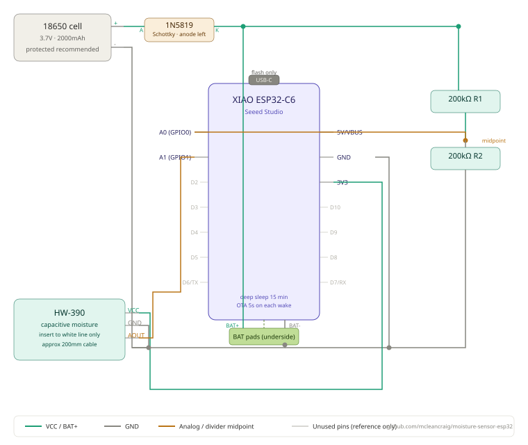

# Garden Soil Moisture Sensor

Battery-powered wireless soil moisture sensors for garden and indoor plant use. Each unit reads capacitive soil moisture and battery level, publishing data over WiFi/MQTT to a home automation hub. Designed for long-term deployment — estimated 5+ months per charge on a 2000mAh 18650 cell.

Built around the Seeed XIAO ESP32-C6, configured entirely via a captive portal web interface with no hardcoded credentials. Integrates natively with Home Assistant via MQTT autodiscovery.

---

## Features

- Capacitive soil moisture reading (0–100%)
- Battery voltage and percentage monitoring
- WiFi provisioning via captive portal — no hardcoded credentials
- Static or DHCP IP addressing, with configurable gateway, subnet and DNS
- Home Assistant MQTT autodiscovery — sensors appear automatically
- Automatic firmware updates via FOTA from GitHub Releases
- Boot button reconfiguration — no reflashing needed to change settings
- Reed switch restart — hold magnet to restart without opening enclosure
- MQTT command support — send `reset` or `restart` remotely via retained message
- Deep sleep between readings — ~15 minute cycle for long battery life
- NTP timestamp in every MQTT payload
- Firmware version reported in every MQTT payload

---

## Wiring diagram



---

## Hardware

### Per sensor

| Component | Detail |
|---|---|
| MCU | Seeed XIAO ESP32-C6 |
| Moisture sensor | HW-390 capacitive, 3-pin (VCC / GND / AOUT) |
| Battery | 18650 Li-ion, 2000mAh recommended |
| Reverse polarity protection | None currently — P-channel MOSFET planned (see TODO) |
| Battery voltage divider | 2x 200kOhm resistors (BAT+ to A0 to GND) |

### Wiring

```
18650 (+) ──────────────────────────── XIAO BAT+ pad
                                        └── 200kOhm ── A0 ── 200kOhm ── GND

18650 (−) ────────────────────────────── XIAO BAT− pad ── GND

HW-390 VCC  ── XIAO 3V3
HW-390 GND  ── GND
HW-390 AOUT ── XIAO A1 (GPIO1)

Reed switch ── GPIO3 ── GND  (normally open, INPUT_PULLUP)
```

The XIAO's onboard charger handles battery charging automatically when USB-C is connected. USB and battery can be connected simultaneously — this is normal and required for charging.

**Note:** No reverse polarity protection is currently fitted. Always check battery orientation before connecting.

---

## Software requirements

### Arduino IDE

Install via the Boards Manager: **esp32 by Espressif Systems**

Board selection: `XIAO_ESP32C6`

### Libraries

Install via the Library Manager:

- **PubSubClient** by Nick O'Leary

All other libraries (`WiFi`, `WebServer`, `DNSServer`, `Preferences`, `HTTPUpdate`, `WiFiClientSecure`, `ESPmDNS`) are included in the ESP32 Arduino core.

---

## Building and flashing

1. Open `moisture-sensor-esp32.ino` in Arduino IDE
2. Select board: **Tools → Board → XIAO_ESP32C6**
3. Connect the sensor via USB-C
4. Select the USB port under **Tools → Port**
5. Click **Upload**

No configuration changes are needed before flashing — all settings are entered via the captive portal after first boot.

---

## First-time setup

On first boot (or after a factory reset), the sensor starts a WiFi access point named:

```
MOISTURE_XXXXXXXXXXXX
```

where `XXXXXXXXXXXX` is the device's unique MAC address.

**To configure:**

1. Connect to the `MOISTURE_` network — password is `moisture`
2. A setup page will appear automatically (captive portal). If it does not, open a browser and navigate to `192.168.4.1`
3. Fill in the form:
   - **Sensor number** — sets the sensor ID (`sensor1`, `sensor2` etc), friendly name, and default static IP last octet
   - **WiFi SSID and password** — your home network credentials
   - **Static IP** — optional. Check the box to assign a fixed IP address. Defaults to `192.168.220.<sensor number>`. When enabled, also configure gateway, subnet mask and DNS
   - **MQTT broker address** — IP address of your MQTT broker (e.g. your Raspberry Pi)
   - **MQTT port** — default 1883
   - **MQTT username / password** — leave blank if your broker does not require authentication
4. Click **Save & Restart**

The sensor will restart, connect to your network, and begin reporting immediately.

If the portal is not used within 10 minutes it will close, the sensor sleeps for 10 minutes, then restarts and tries WiFi again. If WiFi fails on a configured sensor, the portal opens automatically so you can update credentials.

---

## Reconfiguring a deployed sensor

### Boot button (physical access required)

1. Power the sensor on while holding the **boot button** on the XIAO board
2. Hold for 3 seconds until the serial monitor shows `Config — confirmed, clearing config`
3. Release the button — the sensor starts the configuration portal

A brief press under 3 seconds is ignored — normal boot continues.

### Reed switch (no enclosure access needed)

Hold a magnet against the outside of the enclosure for 3 seconds — the sensor restarts. To trigger a full config reset without physical access, use the MQTT command below.

### MQTT command (fully remote)

Publish a retained message to `garden/sensorN/cmd`. The sensor receives it on its next wake cycle, self-clears the retained message, then acts on it:

```bash
# Reset config and open portal:
mosquitto_pub -h localhost -u USER -P PASS \
  -t "garden/sensor1/cmd" -m "reset" --retain

# Soft restart only:
mosquitto_pub -h localhost -u USER -P PASS \
  -t "garden/sensor1/cmd" -m "restart" --retain

# Cancel a pending command:
mosquitto_pub -h localhost -u USER -P PASS \
  -t "garden/sensor1/cmd" -m "" --retain
```

From Home Assistant **Developer Tools → Actions → mqtt.publish**:

```yaml
topic: garden/sensor1/cmd
payload: reset
retain: true
```

---

## Home Assistant integration

The sensor uses MQTT autodiscovery. Once MQTT is configured in Home Assistant:

1. Go to **Settings → Devices & Services → MQTT**
2. Ensure **Enable discovery** is checked and the discovery prefix is `homeassistant`
3. On next sensor boot, a new device will appear automatically under **Settings → Devices**

Each sensor creates these entities in Home Assistant:

| Entity | Unit | Notes |
|---|---|---|
| Moisture | % | Soil moisture level |
| Battery | % | Estimated charge remaining |
| Battery Voltage | V | Raw cell voltage |
| Last Seen | — | NTP timestamp of last reading (UTC) |

The device card also shows the firmware version (`sw_version`) on the device info page.

### MQTT topics

| Topic | Direction | Content |
|---|---|---|
| `garden/sensor1/state` | Sensor to broker | JSON state payload |
| `garden/sensor1/cmd` | Broker to sensor | Command: `reset` or `restart` (retained) |
| `homeassistant/sensor/sensor1_moisture/config` | Sensor to broker | HA discovery config (retained) |
| `homeassistant/sensor/sensor1_battery_v/config` | Sensor to broker | HA discovery config (retained) |
| `homeassistant/sensor/sensor1_battery_pct/config` | Sensor to broker | HA discovery config (retained) |
| `homeassistant/sensor/sensor1_ts/config` | Sensor to broker | HA discovery config (retained) |

### State payload example

```json
{
  "sensor": "sensor1",
  "moisture": 65,
  "moisture_raw_mv": 1843,
  "dry_mv": 2800,
  "wet_mv": 1000,
  "battery_v": 3.87,
  "battery_pct": 62,
  "battery_raw_mv": 1935,
  "fw": "2.1.0",
  "ts": "2026-05-04T14:32:07Z"
}
```

---

## Firmware updates (FOTA)

On each wake the sensor checks GitHub Releases for a newer firmware version and updates itself automatically. No IDE or physical access needed.

**To release a firmware update:**

1. Bump `FIRMWARE_VERSION` in the sketch
2. In Arduino IDE go to **Sketch → Export Compiled Binary** — find the `.bin` file in your sketch folder
3. Create a plain text file `version.txt` containing just the new version number (e.g. `2.1.0`) with no trailing whitespace
4. Create a new GitHub release tagged `vX.X.X`, attach both `moisture-sensor-esp32.ino.bin` and `version.txt` as release assets
5. Every sensor will pick up the update automatically on its next wake cycle

The `fw` field in the MQTT payload confirms the running firmware version. If an update fails the sensor continues operating on the existing firmware and retries on the next wake.

**Tagging and releasing from the command line:**

```bash
git tag -a v2.1.0 -m "v2.1.0 release notes here"
git push origin v2.1.0
```

Then on GitHub go to **Releases → Draft a new release**, select the tag, and attach `firmware.bin` and `version.txt`.

---

## Beta releases

Riskier changes can be shipped to a subset of sensors first via the **beta FOTA channel** (an HA select entity per sensor, `stable` / `beta`) before promoting to everyone.

**To cut a beta:**

1. On the version branch (not `main`), set `FIRMWARE_VERSION` to `X.X.X-bNN` (e.g. `2.11.0-b01`; bump `NN` for a respin — `2.11.0-b02`, etc.)
2. Tag and push: `git tag -a v2.11.0-b01 -m "..." && git push origin v2.11.0-b01`
3. On GitHub, draft a release from that tag and check **Set as a pre-release**, then attach `.bin` and `version.txt` as usual. Pre-releases are invisible to the stable channel (`/releases/latest` skips them) — the beta channel polls the releases API directly and picks them up.
4. Sensors with their channel set to `beta` update to it; stable-channel sensors are unaffected.

**To promote a confirmed beta to stable:**

1. On the version branch, drop the `-bNN` suffix from `FIRMWARE_VERSION` (e.g. `2.11.0-b01` → `2.11.0`)
2. Finalise the `CHANGELOG.md` entry
3. Open the final PR from the version branch into `main` per the branching workflow, and merge
4. Tag and release as normal (`vX.X.X`, *not* a pre-release) — this is what every sensor, not just the beta channel, updates to

`isNewerVersion()` treats stable as always newer than a beta of the same version, and a higher `-bNN` as newer than a lower one, so promoting to stable is picked up by beta-channel sensors automatically, and switching a sensor's channel back and forth is handled without needing a version bump.

---

## Moisture sensor calibration

The HW-390 sensor must be calibrated once per unit for accurate percentage readings. The raw millivolt values are included in every MQTT payload (`moisture_raw_mv`) to assist with this.

**Calibration procedure:**

1. Flash the firmware and configure the sensor
2. Hold the sensor in open air — note the stable `moisture_raw_mv` value. Set this as `DRY_MV` in the firmware (typically ~2800mV)
3. Submerge the sensor to the white line marked on the PCB — note the stable value. Set this as `WET_MV` (typically ~1000mV)
4. Reflash with updated values

The HW-390 is inverted: dry soil reads a higher millivolt value than wet soil. `DRY_MV` should always be greater than `WET_MV`.

---

## Battery life

Based on a 15-minute sleep cycle and 2000mAh cell:

| Phase | Current | Duration per cycle |
|---|---|---|
| Deep sleep | ~15uA | ~895 seconds |
| WiFi + MQTT | ~300mA peak | ~3 seconds |
| FOTA version check | ~80mA | ~2 seconds (no download if firmware is current) |

Estimated runtime: **4–5 months** per charge. Actual runtime depends on WiFi signal strength, temperature, and cell quality.

The battery percentage uses a piecewise linear interpolation of a real 18650 discharge curve, giving accurate readings across the full voltage range rather than fixed steps.

---

## Factory reset

To completely clear all configuration and return to first-boot state:

- **Via MQTT:** send a retained `reset` command (see Reconfiguring a deployed sensor above) — no physical access needed
- **Via USB:** flash the `clear-config` sketch in the `clear-config/` folder, then re-flash the main sketch

---

## Deploying multiple sensors

Each sensor needs only one change — the sensor number is set during portal configuration and everything else derives from it automatically:

| Sensor number | Sensor ID | MQTT topic | Default static IP |
|---|---|---|---|
| 1 | sensor1 | garden/sensor1/state | 192.168.220.1 |
| 2 | sensor2 | garden/sensor2/state | 192.168.220.2 |
| 3 | sensor3 | garden/sensor3/state | 192.168.220.3 |

Each sensor must be calibrated individually as HW-390 units vary slightly from one another.

---

## Troubleshooting

**Sensor not appearing in Home Assistant**
Ensure MQTT integration is enabled in HA and discovery is turned on. Check the broker is reachable and credentials are correct by monitoring `garden/#` on the broker directly:

```bash
mosquitto_sub -h localhost -t "garden/#" -v -u YOUR_USER -P YOUR_PASSWORD
```

**FOTA update not applying**
- Ensure the sensor has internet access — verify DNS is configured correctly in the portal
- Confirm `version.txt` is attached to the latest GitHub release and contains the correct version string with no trailing whitespace or newlines
- Check the `fw` field in the MQTT payload to confirm what version is currently running

**Moisture reading stuck at 0% or 100%**
Recalibrate — the `DRY_MV` and `WET_MV` values in the firmware need to match your specific sensor unit. Check `moisture_raw_mv` in the MQTT payload and compare against your calibration readings.

**Battery reading shows null**
The battery reading falls outside the sanity check range (2.5V–4.3V). Check the voltage divider wiring — two 200kOhm resistors from BAT+ to A0 to GND. Confirm A0 is the pin connected to the midpoint, not A1.

**Sensor getting hot when USB connected**
Check battery polarity. Overheating is caused by reverse polarity on the battery connection, not by USB and battery being connected simultaneously. USB and battery can safely coexist — the onboard charger is designed for this. No polarity protection is currently fitted — always check battery orientation carefully before connecting.

---

## Licence

GPL V2 — see LICENSE.md
